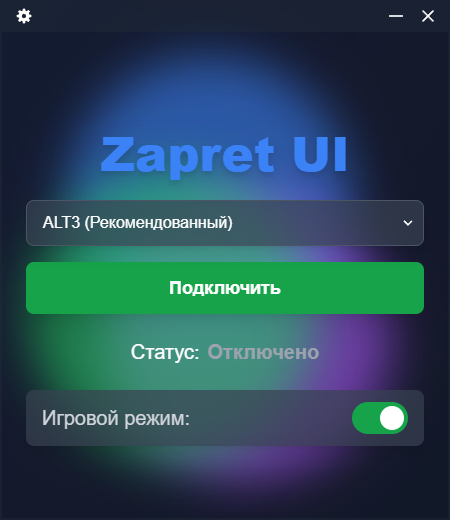
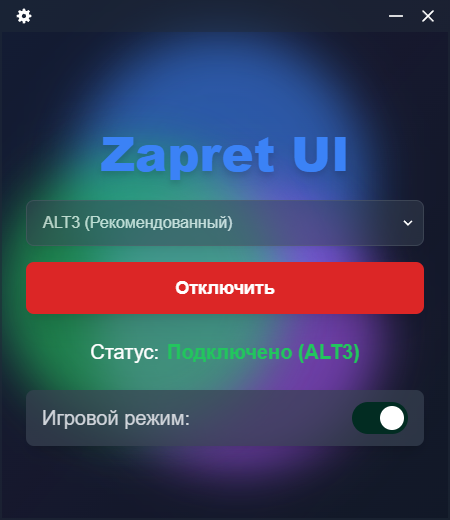
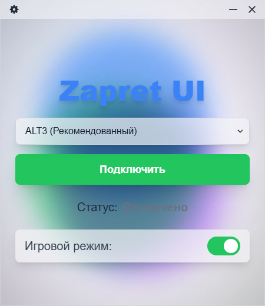
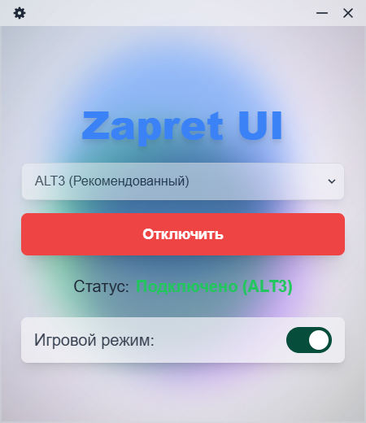

# 
 Zapret UI 

Простой и удобный десктопный интерфейс для управления обходом блокировок

"Plug & Play" обход блокировок иностранных платформ,  **Discord** и  **YouTube** для Windows

Альтернатива: [bol-van/zapret-win-bundle](https://github.com/bol-van/zapret-win-bundle) и [Flowseal/zapret-discord-youtube](https://github.com/Flowseal/zapret-discord-youtube)

---

  
  

---

  
Светлая Тема

  

    
    
  

---

> [!CAUTION]
>
> ### АНТИВИРУСЫ
>
> Драйвер **WinDivert**, который необходим для работы Zapret UI, может вызвать реакцию со стороны антивирусного ПО. WinDivert — это инструмент для перехвата и фильтрации сетевого трафика. Он не является вирусом, но антивирусы могут классифицировать его как потенциально опасное или хакерское ПО, так как он работает на низком уровне системы.
>
> В случае проблем с запуском или работой приложения, вам может потребоваться добавить Zapret UI (желательно всю папку в которую программа установлена) в исключения вашего антивируса или временно отключить его.

---

> [!IMPORTANT]
>
> Все бинарные файлы в папке `bin` были взяты из официального репозитория [zapret-win-bundle/zapret-winws](https://github.com/bol-van/zapret-win-bundle/tree/master/zapret-winws). Вы можете это проверить, используя хэши/контрольные суммы. **Всегда проверяйте, что именно вы запускаете, используя сборки из интернета!**

---

### ✨ Описание

Zapret UI — это десктопное приложение на базе **Electron**, созданное для упрощения использования инструмента обхода блокировок `zapret` на Windows. Вместо работы с командной стролой вы получаете интуитивно понятный графический интерфейс, который позволяет управлять подключением и настройками в один клик.

В основу приложения легли **PowerShell-скрипты**, вдохновленные логикой бат-файлов из проекта [Flowseal/zapret-discord-youtube](https://github.com/Flowseal/zapret-discord-youtube), а также оригинальный инструмент `zapret` от [bol-van/zapret](https://github.com/bol-van/zapret).

---

### 🚀 Функции

* **Простой интерфейс:** Запуск и отключение обхода одним нажатием кнопки.
* **Выбор стратегии:** Быстрое переключение между различными стратегиями обхода.
* **Игровой режим:** Отдельная опция для включения/отключения игрового режима.
* **Автозапуск:** Возможность запускать приложение вместе с Windows для автоматического подключения.
* **Работа в трее:** Приложение может работать в фоновом режиме, оставаясь доступным через иконку в системном трее.

---

### 🛠️ Установка

1.  **Скачайте** последнюю версию приложения с [GitHub Releases](https://github.com/qwzarter/zapretui/releases).
2.  **Запустите** установщик (`.exe`).
3.  **Запустите** Zapret UI.

---

### 🕹️ Использование

* На главном экране выберите желаемую стратегию из выпадающего списка.
* Нажмите кнопку **"Подключиться"**, чтобы запустить обход блокировок. Кнопка изменится на **"Отключиться"**.
* В настройках (иконка шестеренки в правом верхнем углу) вы можете включить автоматическое подключение, автозапуск, настроить трей и сменить тему.
* Вы можете свернуть приложение в системный трей, нажав на кнопку "Закрыть" (крестик) в заголовке окна, если включена соответствующая настройка.

---

### 🗒️ Добавление адресов прочих заблокированных ресурсов

Список блокирующихся адресов для обхода можно расширить, добавляя их в:

* [`list-general.txt`](./bat_scripts/ps1/lists/list-general.txt) для доменов (поддомены автоматически учитываются)
* [`ipset-all.txt`](./bat_scripts/ps1/lists/ipset-all.txt) для IP и подсетей

---

### ⚖️ Лицензирование

Проект распространяется на условиях лицензии [MIT](LICENSE://github.com/qwzarter/zapretui/blob/master/LICENSE.

---

### 🙏 Благодарности и исходники

Этот проект не был бы возможен без работы следующих разработчиков:

* [bol-van](https://github.com/bol-van) ([bol-van/zapret](https://github.com/bol-van/zapret)): Автор оригинального инструмента `zapret`.
* [Flowseal](https://github.com/Flowseal) ([Flowseal/zapret-discord-youtube](https://github.com/Flowseal/zapret-discord-youtube)): Автор батников (соответственно и PowerShell-скриптов), которые используются в качестве основы логики управления. И ещё много чего что я не буду упоминать.
* [basil00](https://github.com/basil00) ([basil00/WinDivert](https://github.com/basil00/WinDivert)): Автор драйвера WinDivert, необходимого для работы zapret.

---

### ⭐ Поддержка проекта

Вы можете поддержать проект, поставив :star: этому репозиторию.

Также, вы можете материально поддержать разработчика zapret [тут](https://boosty.to/bol-van).
